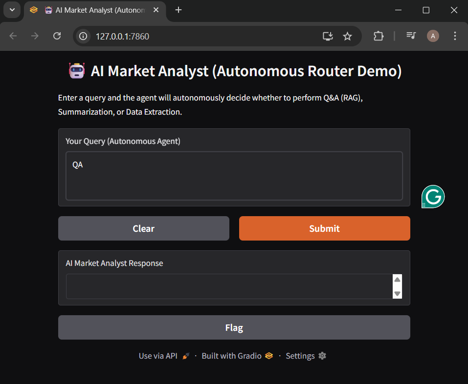

```markdown
# AI Market Analyst Agent

## Project Description

This project provides an AI Market Analyst Agent designed to interact with PDF documents. Leveraging Google's Gemini API, it offers three core functionalities:
1.  **Question & Answer (Q&A):** Ask specific questions about the content of a PDF and get direct answers.
2.  **Market Research Summarization:** Obtain a comprehensive summary of market research findings, insights, and trends from a PDF document.
3.  **Structured Data Extraction:** Extract specific structured data (e.g., company names, market shares) from PDFs in a desired format, such as JSON.

## Setup Instructions

Follow these steps to set up and run the AI Market Analyst Agent locally:

### Prerequisites

*   Python 3.8+
*   pip (Python package installer)
*   A Google Cloud Project with the Gemini API enabled and an API Key.

### Installation

1.  **Clone the Repository:**
    ```bash
    git clone <repository_url>
    cd AI-Market-Analyst-Agent
    ```

2.  **Create a Virtual Environment (Recommended):**
    ```bash
    python -m venv venv
    source venv/bin/activate  # On Windows: .venv\Scripts\activate
    ```

3.  **Install Dependencies:**
    ```bash
    pip install -r requirements.txt
    ```

4.  **Set up your Google API Key:**
    Create a `.env` file in the root directory of the project based on `.env.example` and add your Google API Key:
    ```
    GOOGLE_API_KEY="YOUR_GOOGLE_API_KEY"
    ```
    Replace `YOUR_GOOGLE_API_KEY` with your actual API key.

## How to Run the Agent

Initialize Vector Database (RAG Setup) Run the setup script once to process the IncAI.pdf document and create the RAG embeddings:

Bash

python setup_rag.py
Launch the Gradio Web UI The main script (main.py) now starts the web application:

Bash

python main.py
The application will launch in your browser (usually at http://localhost:7860)
    ```


## Project Structure

The project is organized into the following directories and files:

*   `agents/`:
*    `gemini_utils.py`
    *   `ask_gemini_about_pdf`: Contains the function for answering questions about PDF content.
    *   `extract_market_research_findings`: Implements the function for summarizing market research from PDFs.
    *   `extract_structured_data_from_pdf`: Provides the function for extracting structured data from PDFs.
*   
    *   `main.py`: The main script that provides the interactive command-line interface for the agent, integrating functions from the `agents` directory.
*   
    *   `.env.example`: A template file showing how to set up environment variables, specifically the `GOOGLE_API_KEY`.
*   `requirements.txt`: Lists all Python dependencies required for the project.
*   `.gitignore`: Specifies files and directories to be ignored by Git.
*   `README.md`: This file, providing an overview and instructions for the project.


This project includes a user-friendly web interface built with Gradio that demonstrates the agent's full capabilities and the Autonomous Routing feature.

🎯 Key Features of the UI:
Single Input Field: The user only interacts with one main input box.

Autonomous Routing: Based on the user's query, the embedded router (powered by the LLM) automatically directs the request to the correct underlying tool:

Q&A (RAG): Used for specific questions or fact retrieval.

SUMMARIZE: Used for high-level overviews or general synthesis.

EXTRACT: Used when the user requests structured output (e.g., JSON lists of companies or risks).

Real-time Feedback: The UI provides immediate confirmation of which tool the router selected for the query.

## working of code
Welcome to the AI Market Analyst Agent!

Choose an action:
1. Ask a question about the PDF
2. Get market research summary
3. Extract structured data
4. Exit
Enter your choice (1-4): 1
Enter your question: How it gives service to the public?

--- Answer ---
Based on the text provided, Innovate Inc. serves the public by offering enterprise-level AI workflow automation software. This software, particularly their flagship product "Automata Pro," helps businesses, especially those in logistics and supply chain, to increase efficiency and reduce operational costs. This in turn can lead to lower prices or better service for the end consumer. Additionally, the company's expansion into sectors like healthcare can lead to improvements in those fields, ultimately benefiting the public.

--------------

Choose an action:
1. Ask a question about the PDF
2. Get market research summary
3. Extract structured data
4. Exit
Enter your choice (1-4): 3


Enter extraction_prompt: Extract the company names, their market shares, the current market size (in billions), and the projected market size by 2030 (in billions) from this document. Present the information as a JSON object with keys like "companies" (an array of objects with "name" and "market_share" keys), "current_market_size", and "projected_market_size_2030".


		```json
		{
		  "companies": [
		    {
		      "name": "Innovate Inc.",
		      "market_share": "12%"
		    },
		    {
		      "name": "Synergy Systems",
		      "market_share": "18%"
		    },
		    {
		      "name": "FutureFlow",
		      "market_share": "15%"
		    },
		    {
		      "name": "QuantumLeap",
		      "market_share": "3%"
		    }
		  ],
		  "current_market_size": 15,
		  "projected_market_size_2030": 40
		}
		```

--------------

Design Decisions

1. Chunking Strategy
Size: 500 characters

Overlap: 50 characters (10% of chunk size)

Justification: This size was chosen to capture the necessary semantic context around complex technical terms or analytical statements common in market research without overwhelming the embedding model with extraneous noise. A small overlap ensures that key phrases or sentences split between two chunks remain fully readable for the LLM during the final generation stage.

2. Embedding Model
Model Used: models/gemini-embedding-001

Justification: We selected the official Google AI embedding model for its robust performance in the financial and technical domain (as measured by MTEB benchmarks) and its seamless low-latency integration with the google-genai SDK and LangChain.

3. Vector Database
Database Used: ChromaDB

Justification: ChromaDB was chosen for its lightweight, zero-setup, and in-memory persistence capabilities, making it ideal for a portable, local-first demonstration project. It fulfills the vector storage requirement without needing external infrastructure or complex configurations.

4. Data Extraction Prompt
Design Rationale: The extraction prompt is engineered for reliability using strict formatting rules and direct constraints, including:

Schema Definition: Explicitly requesting a JSON structure with required key names.

Output Constraint: Using phrasing like "Respond ONLY with a valid, clean JSON object" to minimize LLM preamble and hallucinations.

Targeting: Directing the LLM to specific entities (company names, market shares, risks) to maximize extraction accuracy.